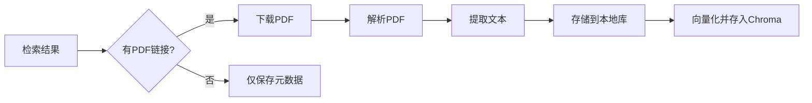

# Skill 6 实施计划：专利检索与分析

> **模块名称**: Patent Search & Analysis  
> **优先级**: P0（最高）  
> **预计工期**: 2-3周  
> **目标**: 实现基于Google Patents的专利检索，支持历史管理和智能对比分析

---

## 📋 目录
1. [功能需求细化](#1-功能需求细化)
2. [技术架构设计](#2-技术架构设计)
3. [数据库设计](#3-数据库设计)
4. [核心模块实现](#4-核心模块实现)
5. [前后端接口](#5-前后端接口)
6. [开发计划](#6-开发计划)

---

## 1. 功能需求细化

### 1.1 核心功能

#### A. 专利检索（Google Patents）
**功能描述**：通过Google Patents检索专利信息，支持多种检索策略。

**检索源**：
- Google Patents（优先）- 使用 `site:patents.google.com` 限定
- 支持扩展：Google Patents API（未来）、BigQuery（未来）

**检索策略**：
```python
# 策略1：关键词检索
query = "区块链 数据加密 site:patents.google.com"

# 策略2：IPC分类号检索
query = "区块链 IPC:H04L9/00 site:patents.google.com"

# 策略3：组合检索
query = "区块链 密钥管理 IPC:H04L9/08 filetype:pdf site:patents.google.com"
```

**输出**：
- 专利标题、摘要、链接、发布日期
- PDF下载链接（如可获取）
- IPC分类号
- 申请号/公开号

---

#### B. 检索历史管理
**功能描述**：记录所有检索历史，支持查看、复用、分析。

**核心功能**：
1. **记录检索条件**：
   - 关键词
   - IPC分类
   - 检索时间
   - 结果数量
2. **查看历史**：
   - 按时间倒序列表
   - 支持按关键词筛选
3. **复用检索**：
   - 一键重新执行历史检索
   - 对比新旧结果差异
4. **统计分析**：
   - 热门检索词
   - 检索成功率

**数据结构**：
```json
{
  "search_id": "uuid",
  "query": "区块链 数据加密",
  "filters": {
    "ipc": "H04L9/00",
    "date_range": "2020-2024"
  },
  "result_count": 15,
  "created_at": "2026-01-18T21:00:00",
  "results": [...]  // 检索结果列表
}
```

---

#### C. 技术方案对比分析（核心增强）
**功能描述**：对检索结果进行智能分析，提取共性特征。

##### C.1 共性关键词分析
**目标**：识别多篇专利中的高频技术术语。

**实现逻辑**：
```python
# 1. 提取所有专利的标题+摘要
texts = [patent['title'] + ' ' + patent['abstract'] for patent in results]

# 2. 中文分词（jieba）
keywords_all = []
for text in texts:
    keywords = jieba.analyse.extract_tags(text, topK=20, withWeight=True)
    keywords_all.extend(keywords)

# 3. 统计词频，过滤通用词
common_keywords = Counter(keywords_all).most_common(10)

# 4. 输出：共性关键词列表（含频率）
{
  "共性关键词": [
    {"word": "区块链", "frequency": 12, "weight": 0.85},
    {"word": "密钥管理", "frequency": 8, "weight": 0.72},
    {"word": "分布式存储", "frequency": 7, "weight": 0.68}
  ]
}
```

**输出用途**：
- 用户可基于共性关键词进一步精准检索
- 识别技术热点和趋势

---

##### C.2 IPC分类号统计与分析
**目标**：提取所有专利的IPC分类，识别技术聚类。

**IPC分类号说明**：
- **H04L9/00**：密码编排；数据加密
- **H04L9/08**：密钥分配
- **G06F21/60**：数据保护

**实现逻辑**：
```python
# 1. 从专利元数据中提取IPC分类号
ipc_codes = []
for patent in results:
    ipc_codes.extend(patent.get('ipc_classifications', []))

# 2. 统计IPC分类频率
ipc_stats = Counter(ipc_codes).most_common()

# 3. 分析IPC层级分布
# H04L9/00 -> 大类H（电学）-> 小类H04（通信）-> 主组H04L9（密码）
ipc_hierarchy = classify_ipc_hierarchy(ipc_stats)

# 4. 输出
{
  "IPC分类统计": [
    {"code": "H04L9/00", "count": 10, "name": "密码编排"},
    {"code": "G06F21/60", "count": 5, "name": "数据保护"}
  ],
  "技术领域分布": {
    "H（电学）": 12,
    "G（物理）": 5
  }
}
```

**输出用途**：
- 快速定位技术聚类
- 基于IPC分类进一步精准检索：`IPC:H04L9/08 区块链`

---

##### C.3 对比报告生成
**目标**：生成可视化对比报告。

**内容结构**：
```markdown
# 专利技术方案对比报告

## 检索概况
- 检索关键词：区块链 数据加密
- 检索时间：2026-01-18
- 结果数量：15篇

## 共性关键词分析
| 关键词 | 频率 | 权重 |
|--------|------|------|
| 区块链 | 12 | 0.85 |
| 密钥管理 | 8 | 0.72 |

**建议进一步检索**：
- "区块链 密钥管理 多重签名"
- "区块链 时间锁 IPC:H04L9/08"

## IPC分类分布
| IPC分类 | 数量 | 技术领域 |
|---------|------|----------|
| H04L9/00 | 10 | 密码编排 |
| G06F21/60 | 5 | 数据保护 |

## 技术方案对比（Top 3相似专利）
### 1. CN123456A vs 本申请
| 技术特征 | 本申请 | CN123456A | 差异 |
|---------|--------|-----------|------|
| 密钥存储 | 区块链分布式 | 区块链分布式 | ✅ 相同 |
| 签名机制 | 多重签名 | 单一签名 | ❌ 不同 |
```

---

#### D. PDF下载与解析
**功能描述**：自动下载专利PDF并解析内容。

**流程**：


**存储位置**：
```
data/patents/google_search/
├── CN123456A.pdf
├── CN234567B.pdf
└── metadata.json  # 元数据索引
```

---

## 2. 技术架构设计

### 2.1 整体架构
```
┌─────────────────────────────────────────────────────┐
│                    前端（React）                      │
│  - 检索界面                                          │
│  - 历史查看                                          │
│  - 对比分析可视化                                     │
└──────────────────┬──────────────────────────────────┘
                   │ REST API
┌──────────────────▼──────────────────────────────────┐
│              后端（FastAPI）                          │
│  ┌────────────────────────────────────────────────┐ │
│  │  API层（routes/search.py）                     │ │
│  └────────────────┬───────────────────────────────┘ │
│                   │                                  │
│  ┌────────────────▼───────────────────────────────┐ │
│  │  业务逻辑层（services/）                        │ │
│  │  - search_service.py                           │ │
│  │  - history_service.py                          │ │
│  │  - analysis_service.py                         │ │
│  └────────────────┬───────────────────────────────┘ │
│                   │                                  │
│  ┌────────────────▼───────────────────────────────┐ │
│  │  Skill层（skills/patent_search/）              │ │
│  │  - google_search_client.py                     │ │
│  │  - pdf_parser.py                               │ │
│  │  - keyword_analyzer.py                         │ │
│  │  - ipc_classifier.py                           │ │
│  └────────────────┬───────────────────────────────┘ │
└───────────────────┼──────────────────────────────────┘
                    │
        ┌───────────┴────────────┐
        │                        │
┌───────▼────────┐    ┌──────────▼──────────┐
│  MySQL/SQLite  │    │  Chroma向量数据库    │
│  - 检索历史     │    │  - 专利全文向量      │
│  - 专利元数据   │    │                     │
└────────────────┘    └─────────────────────┘
```

### 2.2 技术栈
| 组件 | 技术选型 | 说明 |
|------|---------|------|
| Google Patents | SerpAPI 或 自定义爬虫 | 推荐SerpAPI（付费但稳定） |
| 中文分词 | jieba | 共性关键词提取 |
| IPC分类 | 正则匹配 + IPC数据库 | 从专利元数据提取 |
| PDF下载 | requests | 支持断点续传 |
| PDF解析 | pdfplumber | 共享工具 |
| 向量化 | DeepSeek Embedding | LLM抽象层 |

---

## 3. 数据库设计

### 3.1 检索历史表
```sql
CREATE TABLE search_history (
    id VARCHAR(36) PRIMARY KEY,
    user_id VARCHAR(36) NOT NULL,
    query TEXT NOT NULL,                -- 检索关键词
    filters JSON,                       -- 筛选条件（IPC、时间等）
    source VARCHAR(50) DEFAULT 'google_search',
    result_count INT DEFAULT 0,
    status VARCHAR(20),                 -- success, failed, pending
    created_at TIMESTAMP DEFAULT CURRENT_TIMESTAMP,
    INDEX idx_user_created (user_id, created_at)
);
```

### 3.2 专利元数据表
```sql
CREATE TABLE patent_metadata (
    id VARCHAR(36) PRIMARY KEY,
    patent_number VARCHAR(50) UNIQUE,   -- CN123456A
    title VARCHAR(500),
    abstract TEXT,
    ipc_classifications JSON,           -- ["H04L9/00", "G06F21/60"]
    publication_date DATE,
    country_code VARCHAR(10),           -- CN, US, EP
    pdf_url TEXT,
    pdf_local_path TEXT,                -- data/patents/google_search/CN123456A.pdf
    source VARCHAR(50),                 -- google_search, local, bigquery
    created_at TIMESTAMP DEFAULT CURRENT_TIMESTAMP,
    INDEX idx_patent_number (patent_number),
    INDEX idx_ipc (ipc_classifications)
);
```

### 3.3 检索结果关联表
```sql
CREATE TABLE search_results (
    id VARCHAR(36) PRIMARY KEY,
    search_id VARCHAR(36),              -- 关联search_history
    patent_id VARCHAR(36),              -- 关联patent_metadata
    rank INT,                           -- 排名
    similarity_score FLOAT,             -- 相似度（0-100）
    FOREIGN KEY (search_id) REFERENCES search_history(id),
    FOREIGN KEY (patent_id) REFERENCES patent_metadata(id)
);
```

---

## 4. 核心模块实现

### 4.1 Google Patents客户端
**文件**: `skills/patent_search/scripts/google_search_client.py`

```python
import requests
from typing import List, Dict
import os

class GoogleSearchClient:
    """Google Patents API封装"""
    
    def __init__(self, api_key: str = None):
        # 优先使用SerpAPI（推荐），fallback到自定义爬虫
        self.api_key = api_key or os.getenv('SERPAPI_KEY')
        self.base_url = "https://serpapi.com/search"
    
    def search_patents(
        self, 
        query: str, 
        ipc_filter: str = None,
        country: str = None,
        max_results: int = 20
    ) -> List[Dict]:
        """
        检索专利
        Args:
            query: 检索关键词
            ipc_filter: IPC分类号（如 "H04L9/00"）
            country: 国家代码（CN, US, EP）
            max_results: 最大结果数
        Returns:
            List[Dict]: 专利列表
        """
        # 构建搜索查询
        search_query = f"{query} site:patents.google.com"
        if ipc_filter:
            search_query += f" IPC:{ipc_filter}"
        if country:
            search_query += f" country:{country}"
        
        params = {
            "q": search_query,
            "api_key": self.api_key,
            "num": max_results,
            "engine": "google"
        }
        
        response = requests.get(self.base_url, params=params)
        response.raise_for_status()
        
        # 解析结果
        results = self._parse_results(response.json())
        return results
    
    def _parse_results(self, raw_data: Dict) -> List[Dict]:
        """解析API返回的原始数据"""
        patents = []
        for item in raw_data.get('organic_results', []):
            patent = {
                'title': item.get('title'),
                'link': item.get('link'),
                'snippet': item.get('snippet'),  # 摘要
                'date': self._extract_date(item),
                'patent_number': self._extract_patent_number(item['link']),
            }
            patents.append(patent)
        return patents
    
    def _extract_patent_number(self, url: str) -> str:
        """从URL提取专利号"""
        # https://patents.google.com/patent/CN123456A/
        import re
        match = re.search(r'/patent/([A-Z0-9]+)/', url)
        return match.group(1) if match else None
```

---

### 4.2 关键词提取器
**文件**: `skills/patent_search/scripts/keyword_analyzer.py`

```python
import jieba.analyse
from collections import Counter
from typing import List, Dict

class KeywordAnalyzer:
    """共性关键词分析"""
    
    def __init__(self):
        # 加载停用词（通用词、无意义词）
        self.stopwords = self._load_stopwords()
    
    def extract_common_keywords(
        self, 
        patents: List[Dict], 
        top_k: int = 10
    ) -> List[Dict]:
        """
        提取多篇专利的共性关键词
        Args:
            patents: 专利列表（需包含title和abstract字段）
            top_k: 返回Top K关键词
        Returns:
            List[Dict]: [{"word": "区块链", "frequency": 12, "weight": 0.85}, ...]
        """
        all_keywords = []
        
        for patent in patents:
            text = f"{patent['title']} {patent.get('abstract', '')}"
            # jieba提取关键词（TF-IDF）
            keywords = jieba.analyse.extract_tags(
                text, 
                topK=20, 
                withWeight=True
            )
            # 过滤停用词
            keywords = [
                (word, weight) for word, weight in keywords 
                if word not in self.stopwords
            ]
            all_keywords.extend(keywords)
        
        # 统计词频
        word_freq = Counter([word for word, _ in all_keywords])
        word_weights = {}
        for word, weight in all_keywords:
            if word not in word_weights:
                word_weights[word] = []
            word_weights[word].append(weight)
        
        # 计算平均权重
        result = []
        for word, freq in word_freq.most_common(top_k):
            avg_weight = sum(word_weights[word]) / len(word_weights[word])
            result.append({
                "word": word,
                "frequency": freq,
                "weight": round(avg_weight, 2)
            })
        
        return result
    
    def suggest_queries(self, common_keywords: List[Dict]) -> List[str]:
        """基于共性关键词生成推荐检索语句"""
        suggestions = []
        # 取Top 3关键词组合
        top_words = [kw['word'] for kw in common_keywords[:3]]
        
        # 生成二元组合
        for i in range(len(top_words)):
            for j in range(i+1, len(top_words)):
                suggestions.append(f"{top_words[i]} {top_words[j]}")
        
        return suggestions
    
    def _load_stopwords(self) -> set:
        """加载停用词表"""
        # 简化版，实际应从文件加载
        return {"的", "是", "在", "和", "与", "等", "及"}
```

---

### 4.3 IPC分类分析器
**文件**: `skills/patent_search/scripts/ipc_classifier.py`

```python
from collections import Counter
from typing import List, Dict
import json

class IPCClassifier:
    """IPC分类号分析"""
    
    def __init__(self, ipc_db_path: str = "resources/ipc_classification.json"):
        # 加载IPC分类数据库（需预先准备）
        with open(ipc_db_path, 'r', encoding='utf-8') as f:
            self.ipc_db = json.load(f)
    
    def extract_ipc_codes(self, patent: Dict) -> List[str]:
        """从专利元数据中提取IPC分类号"""
        # 策略1：从patent['ipc_classifications']字段获取
        if 'ipc_classifications' in patent:
            return patent['ipc_classifications']
        
        # 策略2：从摘要或描述中正则提取
        import re
        text = f"{patent.get('abstract', '')} {patent.get('description', '')}"
        # IPC格式：H04L9/00, G06F21/60
        ipc_pattern = r'\b[A-H]\d{2}[A-Z]\d{1,3}/\d{2,4}\b'
        return re.findall(ipc_pattern, text)
    
    def analyze_ipc_distribution(self, patents: List[Dict]) -> Dict:
        """
        分析IPC分类分布
        Returns:
            {
                "ipc_stats": [{"code": "H04L9/00", "count": 10, "name": "..."}],
                "section_stats": {"H(电学)": 12, "G(物理)": 5}
            }
        """
        all_ipc_codes = []
        for patent in patents:
            codes = self.extract_ipc_codes(patent)
            all_ipc_codes.extend(codes)
        
        # IPC分类统计
        ipc_counter = Counter(all_ipc_codes)
        ipc_stats = []
        for code, count in ipc_counter.most_common():
            ipc_stats.append({
                "code": code,
                "count": count,
                "name": self._get_ipc_name(code)
            })
        
        # 大类统计（Section: A-H）
        sections = [code[0] for code in all_ipc_codes]
        section_counter = Counter(sections)
        section_stats = {
            f"{sec}({self._get_section_name(sec)})": count
            for sec, count in section_counter.items()
        }
        
        return {
            "ipc_stats": ipc_stats,
            "section_stats": section_stats
        }
    
    def _get_ipc_name(self, code: str) -> str:
        """查询IPC分类名称"""
        return self.ipc_db.get(code, "未知分类")
    
    def _get_section_name(self, section: str) -> str:
        """IPC大类名称"""
        mapping = {
            "A": "人类生活必需",
            "B": "作业、运输",
            "C": "化学、冶金",
            "D": "纺织、造纸",
            "E": "固定建筑物",
            "F": "机械工程",
            "G": "物理",
            "H": "电学"
        }
        return mapping.get(section, "未知")
```

---

## 5. 前后端接口

### 5.1 REST API设计

#### 5.1.1 检索接口
```
POST /api/v1/patent-search/search
```

**请求体**：
```json
{
  "query": "区块链 数据加密",
  "filters": {
    "ipc": "H04L9/00",
    "country": "CN",
    "date_range": ["2020-01-01", "2024-12-31"]
  },
  "max_results": 20,
  "download_pdfs": false
}
```

**响应**：
```json
{
  "search_id": "uuid-1234",
  "result_count": 15,
  "results": [
    {
      "patent_number": "CN123456A",
      "title": "一种区块链数据加密方法",
      "abstract": "...",
      "ipc_classifications": ["H04L9/00"],
      "publication_date": "2023-05-15",
      "pdf_url": "https://...",
      "similarity_score": 85.5
    }
  ],
  "common_keywords": [...],
  "ipc_distribution": {...}
}
```

#### 5.1.2 检索历史接口
```
GET /api/v1/patent-search/history?page=1&limit=10
```

**响应**：
```json
{
  "total": 50,
  "page": 1,
  "limit": 10,
  "items": [
    {
      "search_id": "uuid-1234",
      "query": "区块链 数据加密",
      "result_count": 15,
      "created_at": "2026-01-18T21:00:00",
      "status": "success"
    }
  ]
}
```

#### 5.1.3 对比分析接口
```
POST /api/v1/patent-search/compare
```

**请求体**：
```json
{
  "search_id": "uuid-1234",
  "patent_ids": ["patent-1", "patent-2", "patent-3"],
  "analyze_keywords": true,
  "analyze_ipc": true
}
```

---

## 6. 开发计划

### 阶段1：基础设施（3天）
- [ ] 项目骨架搭建（backend/、frontend/、shared/）
- [ ] PDF解析工具 (`shared/utils/pdf_parser.py`)
- [ ] LLM抽象层 (`shared/utils/llm_client.py`)
- [ ] 数据库初始化（SQLite本地测试）

### 阶段2：Google Patents集成（4天）
- [ ] Google Patents客户端实现
- [ ] 专利元数据解析
- [ ] 检索结果存储
- [ ] 单元测试

### 阶段3：检索历史管理（2天）
- [ ] 数据库表创建
- [ ] 历史记录CRUD接口
- [ ] 历史查看前端页面

### 阶段4：对比分析（5天）
- [ ] 关键词提取器实现
- [ ] IPC分类分析器实现
- [ ] 对比报告生成
- [ ] 前端可视化（关键词云、IPC分布图）

### 阶段5：PDF处理（3天）
- [ ] PDF下载功能
- [ ] PDF解析与向量化
- [ ] Chroma向量库集成

### 阶段6：前后端集成与测试（3天）
- [ ] 前端界面开发（React）
- [ ] API集成测试
- [ ] 端到端测试

---

## 验收标准

### 功能验收
- [ ] Google Patents检索正常，返回Top 20结果
- [ ] 检索历史正确记录，可查看和复用
- [ ] 共性关键词提取准确率 > 80%
- [ ] IPC分类识别准确率 > 90%
- [ ] PDF下载成功率 > 85%
- [ ] 对比报告内容完整

### 性能验收
- [ ] 单次检索响应 < 10秒
- [ ] 历史查询 < 1秒
- [ ] 对比分析 < 5秒

### 质量验收
- [ ] 单元测试覆盖率 > 80%
- [ ] 集成测试通过
- [ ] 前端界面友好、无明显bug

---

**下一步行动**：开始阶段1基础设施搭建
