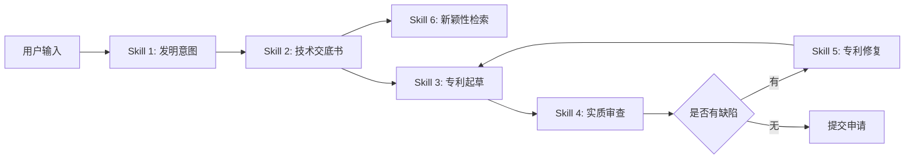

# 专利专家系统 - 需求文档（Skill架构版）

> **文档版本**: v2.0 (Skill-Based Architecture)  
> **创建日期**: 2026-01-18  
> **项目路径**: `/Users/weipeng/Desktop/农行专利/2026/patent_agnet`  
> **架构模式**: Agent Skill  
> **目标**: 建立模块化、可组合的专利全流程AI辅助系统

---

## 📋 目录
1. [项目概述](#1-项目概述)
2. [架构设计理念](#2-架构设计理念)
3. [核心Skill设计](#3-核心skill设计)
4. [共享基础设施](#4-共享基础设施)
5. [数据架构](#5-数据架构)
6. [技术栈与约束](#6-技术栈与约束)
7. [验收标准](#7-验收标准)

---

## 1. 项目概述

### 1.1 背景与目标
作为企业工程师，需要将技术创新转化为高质量专利申请。本系统通过**Agent Skill架构**，提供覆盖专利全生命周期的AI辅助能力，提升撰写质量和授权率。

### 1.2 核心价值主张
- **模块化**：每个skill独立开发、测试、部署
- **可组合**：通过workflow灵活编排skills
- **可扩展**：新增skill不影响现有功能
- **专业化**：输出严格遵循《专利审查指南》

### 1.3 用户角色
- **主要用户**：企业研发工程师（本人）
- **技能水平**：技术能力强，专利经验有限
- **使用场景**：从技术创意到专利授权的完整流程

---

## 2. 架构设计理念

### 2.1 Skill架构说明
每个Skill是一个**独立的功能单元**，包含：
- **SKILL.md**：功能说明、输入输出、使用指南
- **scripts/**：核心逻辑实现（Python）
- **templates/**：输出模板（Markdown格式）
- **resources/**：参考资料（如审查指南）

### 2.2 项目目录结构
```
patent_agnet/
├── README.md                    # 项目说明
├── requirements.md              # 本文档
├── .agent/
│   └── workflows/               # 工作流定义
│       ├── full_process.md      # 完整申请流程
│       ├── quick_draft.md       # 快速起草
│       └── repair_patent.md     # 专利修复流程
│
├── skills/                      # 核心Skill目录
│   ├── invention_intent/        # Skill 1
│   ├── disclosure_writing/      # Skill 2
│   ├── patent_drafting/         # Skill 3
│   ├── patent_examination/      # Skill 4
│   ├── patent_repair/           # Skill 5
│   └── patent_search/           # Skill 6
│
├── shared/                      # 共享基础设施
│   ├── utils/
│   │   ├── pdf_parser.py        # PDF解析
│   │   ├── llm_client.py        # LLM抽象层
│   │   └── markdown_formatter.py
│   ├── db/
│   │   ├── models.py            # 数据库模型
│   │   └── repositories.py      # 数据访问层
│   └── vector_store/
│       └── chroma_manager.py    # 向量数据库管理
│
├── backend/                     # Python后端
│   ├── app/
│   │   ├── main.py
│   │   ├── api/                 # REST API
│   │   └── services/            # 业务逻辑
│   ├── tests/                   # 测试（仅SQLite）
│   └── requirements.txt
│
├── frontend/                    # Node.js前端
│   ├── src/
│   │   ├── components/
│   │   ├── pages/
│   │   └── services/
│   ├── package.json
│   └── public/
│
├── data/                        # 数据目录
│   ├── patents/                 # 本地专利库（TXT/PDF）
│   ├── vector_db/               # Chroma向量数据库
│   └── templates/               # 通用模板
│
├── docs/                        # 文档
│   ├── 专利审查指南.pdf
│   └── api_spec.md
│
└── docker-compose.yml           # 本地部署配置
```

### 2.3 Skill之间的协作


---

## 3. 核心Skill设计

### Skill 1: 发明意图总结 (invention_intent)

#### 功能概述
通过多轮对话引导用户完整表达技术创意，自动生成结构化的发明意图文档。

#### 目录结构
```
skills/invention_intent/
├── SKILL.md                     # Skill说明文档
├── scripts/
│   ├── conversation_manager.py  # 对话管理
│   ├── intent_extractor.py      # 意图提取
│   └── document_generator.py    # 文档生成
├── templates/
│   ├── intent_template.md       # 发明意图模板
│   └── question_bank.json       # 引导性问题库
└── resources/
    └── prompt_templates/        # LLM Prompt模板
        ├── extract_problem.txt
        ├── extract_solution.txt
        └── summarize_intent.txt
```

#### 核心功能
1. **智能对话引导**
   - 根据用户输入动态生成后续问题
   - 识别缺失信息（技术问题、解决方案、效果）
   - 最多10轮对话，避免用户疲劳

2. **信息结构化提取**
   - 技术问题识别
   - 现有技术痛点分析
   - 解决方案核心要点
   - 技术效果与创新点

3. **文档生成**
   - 基于`intent_template.md`生成Markdown文档
   - 包含：摘要、技术问题、解决方案、创新点

#### 输入与输出
| 输入 | 输出 |
|------|------|
| 用户对话文本（可多轮） | `invention_intent.md` |
| 可选：参考文档（TXT/PDF） | 创新点列表（JSON） |

#### SKILL.md 内容要点
```markdown
# Skill: 发明意图总结

## 用途
将碎片化的技术创意转化为结构化的发明意图文档

## 使用方法
1. 运行 `python scripts/conversation_manager.py`
2. 输入技术创意描述
3. 回答AI引导问题（5-10轮）
4. 自动生成 `invention_intent.md`

## 依赖
- LLM: DeepSeek API
- 数据库: SQLite（保存对话历史）

## 配置
- `MAX_ROUNDS`: 最大对话轮数（默认10）
- `TEMPLATE_PATH`: 输出模板路径
```

#### 验收标准
- [ ] 支持多轮对话（至少5轮）
- [ ] 自动识别缺失信息并提问
- [ ] 生成符合模板的Markdown文档
- [ ] 对话历史可保存和恢复

---

### Skill 2: 技术交底书撰写 (disclosure_writing)

#### 功能概述
基于发明意图或技术方案文档，生成符合《专利审查指南》的技术交底书。

#### 目录结构
```
skills/disclosure_writing/
├── SKILL.md
├── scripts/
│   ├── document_parser.py       # 解析输入文档（TXT/PDF）
│   ├── section_generator.py     # 各章节生成器
│   ├── novelty_checker.py       # 初步新颖性检查
│   └── disclosure_assembler.py  # 组装完整文档
├── templates/
│   ├── disclosure_template.md   # 技术交底书模板
│   └── section_prompts/         # 各章节Prompt
│       ├── technical_field.txt
│       ├── background.txt
│       ├── invention_content.txt
│       └── embodiments.txt
└── resources/
    └── 专利审查指南.pdf          # 引用规范
```

#### 核心功能
1. **文档解析**
   - 支持TXT、PDF格式
   - 提取技术要点、关键词
   - 识别技术流程、架构图

2. **章节生成**
   - **技术领域**：自动识别IPC分类
   - **背景技术**：总结现有技术痛点
   - **发明内容**：
     - 技术问题
     - 解决方案
     - 有益效果
   - **具体实施方式**：详细技术实现
   - **附图说明**（如有）

3. **初步新颖性检索**
   - 在本地专利库检索相似专利
   - 使用Chroma向量库语义匹配
   - 返回Top 10相似专利

4. **格式校验**
   - 基于《专利审查指南》规范

#### 输入与输出
| 输入 | 输出 |
|------|------|
| 发明意图文档 或 技术方案（TXT/PDF） | `disclosure.md` |
| 可选：附图文件 | 新颖性初步分析报告 |

#### 验收标准
- [ ] 支持TXT/PDF解析
- [ ] 生成包含所有必要章节的交底书
- [ ] 新颖性检索返回至少10个结果
- [ ] 输出符合《专利审查指南》格式

---

### Skill 3: 专利申请文件起草 (patent_drafting)

#### 功能概述
基于技术交底书，生成正式的专利申请文件（权利要求书、说明书、摘要）。

#### 目录结构
```
skills/patent_drafting/
├── SKILL.md
├── scripts/
│   ├── claims_generator.py      # 权利要求书生成
│   ├── specification_generator.py # 说明书生成
│   ├── abstract_generator.py    # 摘要生成
│   ├── format_validator.py      # 格式校验
│   └── consistency_checker.py   # 一致性检查
├── templates/
│   ├── claims_template.md
│   ├── specification_template.md
│   └── abstract_template.md
└── resources/
    ├── 专利审查指南.pdf
    └── claim_writing_guide.md   # 权利要求撰写指南
```

#### 核心功能
1. **权利要求书生成**
   - **独立权利要求**：
     - 前序部分：技术领域、现有技术
     - 特征部分：核心技术特征
     - 单句表达，用"其特征在于"连接
   - **从属权利要求**：
     - 分层设计（2-3层）
     - 引用关系清晰
     - 逐步细化技术方案

2. **说明书生成**
   - 严格按照《专利审查指南》章节结构
   - 技术领域、背景技术、发明内容、具体实施方式
   - 附图说明（如有）
   - 术语一致性检查

3. **摘要生成**
   - 150-300字
   - 包含技术问题、方案要点、效果

4. **格式与一致性校验**
   - 权利要求与说明书一致性
   - 术语统一性
   - 引用规范性（附图、公式）

#### 输入与输出
| 输入 | 输出 |
|------|------|
| 技术交底书 | `claims.md`（权利要求书） |
| 可选：附图 | `specification.md`（说明书） |
|  | `abstract.md`（摘要） |
|  | 格式检查报告 |

#### 验收标准
- [ ] 至少包含1条独立权利要求、3条从属权利要求
- [ ] 说明书包含所有必要章节
- [ ] 通过格式校验（无致命错误）
- [ ] 权利要求与说明书一致

---

### Skill 4: 实质审查模拟 (patent_examination)

#### 功能概述
模拟审查员视角，对申请文件进行全面审查，识别潜在缺陷。

#### 目录结构
```
skills/patent_examination/
├── SKILL.md
├── scripts/
│   ├── formal_examiner.py       # 形式审查
│   ├── novelty_examiner.py      # 新颖性审查
│   ├── inventiveness_examiner.py # 创造性审查
│   ├── clarity_examiner.py      # 清楚性审查
│   ├── support_examiner.py      # 支持性审查
│   └── report_generator.py      # 缺陷报告生成
├── templates/
│   └── examination_report.md    # 审查报告模板
└── resources/
    ├── 专利审查指南.pdf
    └── defect_taxonomy.json     # 缺陷分类体系
```

#### 核心功能
1. **形式审查**
   - 格式规范性（章节完整性、编号规范）
   - 必要内容检查（权利要求、说明书、摘要）

2. **新颖性审查**
   - 调用Skill 6检索对比文件
   - 逐项对比技术特征
   - 识别相同或实质相同的技术方案

3. **创造性审查**
   - 评估技术方案的非显而易见性
   - 分析技术效果的显著性
   - 三步法评估（对比文件、区别特征、技术效果）

4. **清楚性审查**
   - 技术方案表达是否清晰
   - 识别模糊、矛盾描述
   - 术语定义一致性

5. **支持性审查**
   - 权利要求是否得到说明书支持
   - 检查说明书中的实施例

6. **缺陷报告**
   - 问题分类：致命/严重/一般
   - 标注位置（章节、段落、行号）
   - 提供修改建议

#### 输入与输出
| 输入 | 输出 |
|------|------|
| 专利申请文件（claims + specification） | 缺陷识别报告 |
| 可选：对比文件 | 新颖性/创造性分析表 |

#### 验收标准
- [ ] 能识别至少3种类型的缺陷（形式、新颖性、创造性）
- [ ] 缺陷报告标注问题位置和严重程度
- [ ] 新颖性审查至少对比3篇专利

---

### Skill 5: 专利修复 (patent_repair)

#### 功能概述
解析审查意见通知书，提供修改方案和答复意见书。

#### 目录结构
```
skills/patent_repair/
├── SKILL.md
├── scripts/
│   ├── opinion_parser.py        # 审查意见解析
│   ├── defect_analyzer.py       # 问题分析
│   ├── repair_strategy.py       # 修改策略生成
│   ├── claims_modifier.py       # 权利要求修改
│   ├── response_writer.py       # 答复意见撰写
│   └── document_updater.py      # 更新申请文件
├── templates/
│   ├── response_template.md     # 答复意见书模板
│   └── repair_strategies/       # 修改策略库
│       ├── novelty_repair.md
│       ├── inventiveness_repair.md
│       └── clarity_repair.md
└── resources/
    ├── 专利审查指南.pdf
    └── response_examples/       # 答复案例库
```

#### 核心功能
1. **审查意见解析**
   - 解析TXT/PDF格式的审查意见通知书
   - 提取关键问题点
   - 问题分类（新颖性/创造性/清楚性等）

2. **修改策略生成**
   - **新颖性问题**：增加区别技术特征
   - **创造性问题**：强化技术效果、补充实施例
   - **清楚性问题**：修改表述、增加定义
   - 提供2-3个备选方案，评估优劣

3. **权利要求修改**
   - 自动修改权利要求
   - 保持引用关系正确性
   - 标注修改位置（下划线/删除线）

4. **答复意见书撰写**
   - 逐条回应审查意见
   - 引用专利法条款和审查指南
   - 论证逻辑清晰
   - 格式规范

5. **文档更新**
   - 生成修改后的申请文件
   - 对比文件（修改前后差异）

#### 输入与输出
| 输入 | 输出 |
|------|------|
| 审查意见通知书（TXT/PDF） | 审查意见解析报告 |
| 原申请文件 | 修改方案（2-3个） |
|  | `response.md`（答复意见书） |
|  | 修改后的申请文件 |
|  | 对比文件（diff） |

#### 验收标准
- [ ] 能解析审查意见通知书（TXT/PDF）
- [ ] 提供至少2个修改方案
- [ ] 答复意见逐条回应
- [ ] 生成修改后的申请文件和对比文件

---

### Skill 6: 专利检索与分析 (patent_search)

#### 功能概述
提供多源专利数据检索，支持新颖性/创造性分析。

#### 目录结构
```
skills/patent_search/
├── SKILL.md
├── scripts/
│   ├── pdf_parser.py            # PDF文本提取
│   ├── local_indexer.py         # 本地专利库索引
│   ├── google_patents_crawler.py # Google Patents爬虫
│   ├── bigquery_client.py       # BigQuery查询
│   ├── vector_searcher.py       # 向量语义检索
│   ├── result_ranker.py         # 检索结果排序
│   └── comparison_analyzer.py   # 对比分析
├── templates/
│   ├── search_report.md         # 检索报告模板
│   └── comparison_table.md      # 对比表模板
└── resources/
    ├── 专利审查指南.pdf
    └── ipc_classification.json  # IPC分类表
```

#### 核心功能
1. **PDF解析**（核心基础能力）
   - 库选择：pdfplumber（推荐）或 PyPDF2
   - 文本提取、结构识别
   - OCR支持（可选，Tesseract）
   - 输出清洗和格式化

2. **多源检索**
   - **本地专利库**：
     - 用户导入TXT/PDF文件
     - 全文索引（使用Chroma向量库）
     - 关键词搜索 + 语义搜索
   - **Google Patents**：
     - 爬虫实现（requests + BeautifulSoup）
     - 尊重robots.txt和rate limiting
     - 结果解析和存储
   - **Google BigQuery**：
     - 使用`google-cloud-bigquery` SDK
     - 查询`patents-public-data`数据集
     - 支持高级过滤（时间、国家、IPC分类）

3. **语义检索**
   - 使用Chroma向量数据库
   - 技术方案向量化（通过LLM Embedding）
   - 相似度计算（余弦相似度）
   - 混合检索（关键词 + 语义）

4. **检索结果排序**
   - 相似度评分（0-100）
   - 按时间、国家、引用次数过滤
   - 去重处理

5. **对比分析**
   - 选择Top 3-5相似专利
   - 逐项对比技术特征
   - 差异点高亮显示
   - 生成对比表（Markdown表格）

6. **新颖性/创造性评估**
   - 基于对比分析生成评估结论
   - 风险等级：高/中/低
   - 建议：可授权/需修改/风险高

#### 输入与输出
| 输入 | 输出 |
|------|------|
| 技术关键词 或 技术方案文档 | 检索结果列表（JSON） |
| 检索源选择（本地/Google Patents/BigQuery） | `search_report.md` |
|  | 技术方案对比表 |
|  | 新颖性/创造性评估报告 |

#### 验收标准
- [ ] 支持TXT/PDF解析
- [ ] 本地库检索返回Top 20结果
- [ ] Google Patents爬虫正常工作
- [ ] BigQuery查询正常工作
- [ ] 相似度评分准确（0-100）
- [ ] 生成对比表和评估报告

---

## 4. 共享基础设施

### 4.1 PDF解析工具 (shared/utils/pdf_parser.py)

#### 功能
- 提取PDF文本内容
- 识别文档结构（章节、段落）
- 支持扫描件OCR（可选）

#### 技术选型
```python
# 推荐库
import pdfplumber  # 主力，支持表格、布局识别
from pypdf import PdfReader  # 备选，轻量级
import pytesseract  # OCR（可选）
```

#### API设计
```python
class PDFParser:
    def extract_text(self, pdf_path: str) -> str:
        """提取全文文本"""
        pass
    
    def extract_sections(self, pdf_path: str) -> Dict[str, str]:
        """提取章节（标题-内容映射）"""
        pass
    
    def extract_with_ocr(self, pdf_path: str) -> str:
        """OCR提取（扫描件）"""
        pass
```

---

### 4.2 LLM抽象层 (shared/utils/llm_client.py)

#### 功能
- 统一的LLM调用接口
- 支持多LLM切换（DeepSeek/Gemini/Claude）
- 重试机制、错误处理

#### API设计
```python
class LLMClient:
    def __init__(self, provider: str = "deepseek"):
        """provider: deepseek, gemini, claude"""
        pass
    
    def chat(self, messages: List[Dict], **kwargs) -> str:
        """对话接口"""
        pass
    
    def embed(self, text: str) -> List[float]:
        """文本向量化"""
        pass
```

---

### 4.3 向量数据库管理 (shared/vector_store/chroma_manager.py)

#### 功能
- Chroma数据库初始化
- 文档索引、检索
- 相似度搜索

#### API设计
```python
class ChromaManager:
    def __init__(self, db_path: str = "data/vector_db"):
        pass
    
    def add_documents(self, documents: List[str], metadatas: List[Dict]):
        """添加文档"""
        pass
    
    def search(self, query: str, top_k: int = 10) -> List[Dict]:
        """语义搜索"""
        pass
```

---

### 4.4 Markdown格式化工具 (shared/utils/markdown_formatter.py)

#### 功能
- 基于《专利审查指南》的格式约束
- 模板渲染
- 自动编号、引用格式化

---

## 5. 数据架构

### 5.1 数据库设计

#### MySQL（生产环境，专利草稿）
```sql
-- 专利草稿表
CREATE TABLE patent_drafts (
    id VARCHAR(36) PRIMARY KEY,
    user_id VARCHAR(36) NOT NULL,
    patent_type VARCHAR(50),  -- 发明/实用新型/外观设计
    title VARCHAR(255),
    status VARCHAR(50),  -- draft, reviewing, submitted, granted
    content JSON,  -- 存储各章节内容
    version INT DEFAULT 1,
    created_at TIMESTAMP,
    updated_at TIMESTAMP
);

-- 对话历史表（Skill 1使用）
CREATE TABLE conversations (
    id VARCHAR(36) PRIMARY KEY,
    session_id VARCHAR(36),
    user_id VARCHAR(36),
    message TEXT,
    role VARCHAR(20),  -- user, assistant
    created_at TIMESTAMP
);

-- 审查记录表（Skill 4使用）
CREATE TABLE examination_records (
    id VARCHAR(36) PRIMARY KEY,
    draft_id VARCHAR(36),
    examination_type VARCHAR(50),  -- novelty, inventiveness, clarity
    defects JSON,  -- 缺陷列表
    status VARCHAR(50),
    created_at TIMESTAMP
);
```

#### SQLite（开发/测试环境）
- 相同schema，仅用于单元测试
- **约束**：禁止在单测中连接MySQL

---

### 5.2 本地专利库
```
data/patents/
├── cn/          # 中国专利
├── us/          # 美国专利
├── ep/          # 欧洲专利
└── index.json   # 元数据索引
```

---

### 5.3 向量数据库
```
data/vector_db/
└── chroma/      # Chroma持久化存储
    ├── collections/
    └── metadata.json
```

---

## 6. 技术栈与约束

### 6.1 技术栈总览
| 组件 | 技术 | 说明 |
|------|------|------|
| 后端框架 | FastAPI | 异步、高性能、自动API文档 |
| 前端框架 | React (Node.js) | 组件化、生态丰富 |
| 数据库 | SQLite/MySQL | 开发用SQLite，生产用MySQL |
| 向量库 | Chroma | 本地部署、轻量级 |
| LLM | DeepSeek API | 主力模型 |
| LLM备选 | Gemini/Claude | 可切换 |
| PDF解析 | pdfplumber | 文本提取、表格识别 |
| OCR | Tesseract | 扫描件识别（可选） |
| 部署 | Docker Compose | 容器化部署 |

### 6.2 开发约束
- **单元测试**：只能使用SQLite，禁止MySQL
- **代码规范**：Python遵循PEP8，JS遵循ESLint
- **Git管理**：每个Skill独立分支开发
- **文档**：每个Skill必须有完整的SKILL.md

### 6.3 环境要求
- Python ≥ 3.10
- Node.js ≥ 18.0
- Docker ≥ 20.0（可选）

---

## 7. 验收标准

### 7.1 Skill级别验收
每个Skill必须通过：
- [ ] 单元测试覆盖率 > 70%
- [ ] 集成测试通过
- [ ] SKILL.md文档完整
- [ ] 输出符合《专利审查指南》规范（人工抽查）

### 7.2 系统级别验收
- [ ] 完整流程跑通（从创意到专利申请文件）
- [ ] 性能指标达标（见下表）
- [ ] 前后端集成无缝

| 功能 | 性能指标 |
|------|---------|
| 对话响应 | < 3秒 |
| 文档生成 | < 30秒 |
| 本地检索 | < 10秒 |
| 外部检索 | < 30秒 |
| PDF解析（10页） | < 5秒 |

### 7.3 质量验收
- [ ] 输出文档无明显格式错误
- [ ] 新颖性检索准确率 > 80%（人工评估）
- [ ] 审查意见解析正确率 > 90%

---

## 附录

### A. Workflow示例

#### 完整申请流程 (.agent/workflows/full_process.md)
```markdown
---
description: 从创意到专利申请的完整流程
---

# 专利申请完整流程

1. **发明意图总结**
   - 使用 Skill 1: invention_intent
   - 输入：技术创意描述
   - 输出：`invention_intent.md`

2. **技术交底书撰写**
   - 使用 Skill 2: disclosure_writing
   - 输入：`invention_intent.md`
   - 输出：`disclosure.md` + 新颖性初步报告

3. **新颖性深度检索**
   - 使用 Skill 6: patent_search
   - 输入：`disclosure.md`
   - 输出：检索报告、对比分析

4. **专利申请文件起草**
   - 使用 Skill 3: patent_drafting
   - 输入：`disclosure.md`
   - 输出：`claims.md`, `specification.md`, `abstract.md`

5. **实质审查模拟**
   - 使用 Skill 4: patent_examination
   - 输入：申请文件
   - 输出：缺陷报告

6. **修复缺陷（如有）**
   - 使用 Skill 5: patent_repair
   - 输入：缺陷报告 + 申请文件
   - 输出：修改后的申请文件

7. **最终审核**
   - 人工审阅
   - 提交申请
```

### B. 开发优先级建议
1. **第一阶段**：共享基础设施
   - PDF解析、LLM抽象层、Chroma集成
2. **第二阶段**：核心Skill
   - Skill 6（检索） → Skill 2（交底书） → Skill 3（起草）
3. **第三阶段**：辅助Skill
   - Skill 1（意图） → Skill 4（审查） → Skill 5（修复）
4. **第四阶段**：前端集成与优化

---

**文档结束**

> **下一步**：
> 1. 用户审阅并确认需求
> 2. 开始共享基础设施的详细设计
> 3. 创建第一个Skill的实现计划
