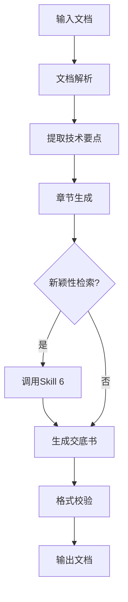

# Skill: 技术交底书撰写 (Disclosure Writing)

## 📌 用途
基于发明意图或技术方案文档，自动生成符合《专利审查指南》规范的技术交底书。

## 🎯 功能概述
- 解析输入文档（TXT/PDF/Markdown）
- 按照标准章节生成技术交底书
- 初步新颖性检索（调用Skill 6）
- 支持迭代优化

## 📥 输入
- **发明意图文档** (`invention_intent.md`)
- **技术方案文档** (TXT/PDF)
- **可选附图**

## 📤 输出
- `disclosure.md`：技术交底书
- 新颖性初步分析报告

## 🔧 使用方法

### 命令行使用
```bash
python scripts/disclosure_assembler.py --input invention_intent.md --output disclosure.md
```

### API调用
```python
from skills.disclosure_writing.scripts.disclosure_assembler import DisclosureAssembler

assembler = DisclosureAssembler()
disclosure = assembler.generate(
    input_file="invention_intent.md",
    novelty_check=True
)
```

### 前端集成
```javascript
POST /api/v1/skills/disclosure-writing/generate
{
  "input_file": "invention_intent.md",
  "novelty_check": true
}
```

## 📋 输出示例

### disclosure.md
```markdown
# 技术交底书

## 发明名称
一种基于区块链的数据加密方法

## 技术领域
本发明涉及数据安全技术领域，具体涉及一种利用区块链技术实现密钥分布式存储的数据加密方法。

## 背景技术
传统数据加密方法采用集中式密钥管理，存在以下问题：
1. 单点故障风险高
2. 密钥容易被攻击
3. 管理成本高

现有技术如CN123456A公开了一种区块链数据存储方法，但未解决密钥安全问题...

## 发明内容

### 要解决的技术问题
本发明旨在解决现有技术中密钥管理安全性低、易被破解的问题。

### 技术方案
一种基于区块链的数据加密方法，包括以下步骤：
1. 初始化区块链网络
2. 生成主密钥并分片
3. 将密钥分片分布式存储到区块链节点
4. 采用多重签名机制验证访问权限
5. 结合时间锁机制防止密钥泄露
...

### 有益效果
1. 提高密钥安全性：分布式存储避免单点故障
2. 降低管理成本：自动化密钥管理
3. 防止密钥泄露：多重签名 + 时间锁双重保护

## 附图说明
（如有）

## 具体实施方式
下面结合具体实施例对本发明进行详细说明：

实施例1：
...
```

## ⚙️ 配置项
```json
{
  "template_path": "templates/disclosure_template.md",
  "novelty_check_enabled": true,
  "section_order": ["technical_field", "background", "invention_content", "embodiments"],
  "min_word_count": {
    "background": 200,
    "invention_content": 500
  }
}
```

## 🔗 依赖
- **PDF解析**: `shared/utils/pdf_parser.py`
- **新颖性检索**: Skill 6 (`patent_search`)
- **LLM**: DeepSeek API
- **模板引擎**: Jinja2

## 📊 核心逻辑

### 生成流程


### 章节生成逻辑
```python
# scripts/section_generator.py
class SectionGenerator:
    def generate_technical_field(self, content):
        """生成技术领域章节"""
        prompt = f"根据以下内容，生成技术领域描述：{content}"
        # 调用LLM生成
        pass
    
    def generate_background(self, content, prior_art):
        """生成背景技术章节"""
        # 结合现有技术，生成背景描述
        pass
```

## 🧪 测试

### 单元测试
```bash
pytest tests/test_section_generator.py
pytest tests/test_disclosure_assembler.py
```

### 测试用例
```python
def test_generate_technical_field():
    generator = SectionGenerator()
    field = generator.generate_technical_field("区块链加密")
    assert "技术领域" in field
    assert len(field) > 50
```

## ✅ 验收标准
- [ ] 支持TXT/PDF/Markdown输入
- [ ] 生成包含所有必要章节
- [ ] 新颖性检索返回Top 10结果
- [ ] 输出符合《专利审查指南》格式
- [ ] 章节字数满足最小要求
- [ ] 单元测试覆盖率 > 70%

## 🔄 版本历史
- v1.0 (2026-01-18): 初始版本
