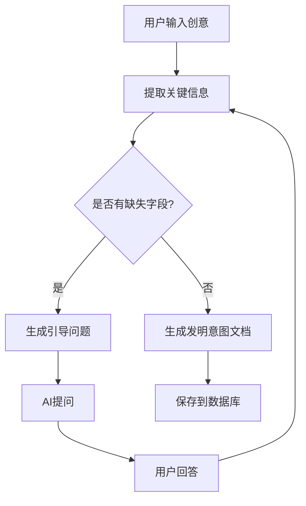

# Skill: 发明意图总结 (Invention Intent Extraction)

## 📌 用途
将碎片化的技术创意，通过AI引导式对话，转化为结构化的发明意图文档。

## 🎯 功能概述
- 多轮对话引导用户完整表达技术方案
- 自动识别缺失信息并提问
- 提取技术问题、解决方案、创新点
- 生成规范的发明意图文档

## 📥 输入
- **用户对话文本**：技术创意的自由描述（可多轮）
- **可选参考文档**：TXT/PDF格式的技术资料

## 📤 输出
- `invention_intent.md`：发明意图文档（Markdown格式）
- 创新点列表（JSON）

## 🔧 使用方法

### 命令行使用
```bash
python scripts/conversation_manager.py
```

### API调用
```python
from skills.invention_intent.scripts.conversation_manager import ConversationManager

manager = ConversationManager()
manager.start_session()
manager.add_user_message("我有一个关于数据加密的想法...")
response = manager.get_ai_response()
intent_doc = manager.generate_document()
```

### 前端集成
```javascript
POST /api/v1/skills/invention-intent/chat
{
  "session_id": "uuid",
  "message": "用户输入的技术创意"
}
```

## 📋 输出示例

### invention_intent.md
```markdown
# 发明意图文档

## 发明名称
一种基于区块链的数据加密方法

## 技术领域
本发明涉及数据安全领域，具体涉及区块链加密技术。

## 技术问题
现有数据加密方法存在密钥管理困难、易被破解等问题。

## 解决方案
采用区块链分布式存储密钥，结合多重签名机制...

## 预期效果
- 提高密钥安全性
- 降低密钥管理成本
- 防止单点故障

## 创新点
1. 首次将区块链应用于密钥分布式存储
2. 创新性地结合多重签名与时间锁机制
3. ...
```

## ⚙️ 配置项

在 `config.json` 中配置：
```json
{
  "max_rounds": 10,
  "min_required_fields": ["technical_problem", "solution", "effect"],
  "template_path": "templates/intent_template.md",
  "llm_provider": "deepseek"
}
```

## 🔗 依赖
- **LLM**: DeepSeek API (或Gemini/Claude)
- **数据库**: SQLite (保存对话历史)
- **共享工具**: `shared/utils/llm_client.py`

## 📊 核心逻辑

### 对话流程


### 引导问题示例
- "您要解决的核心技术问题是什么？"
- "现有技术有哪些不足或痛点？"
- "您的解决方案的关键步骤是什么？"
- "相比现有技术，您的方案有哪些优势？"

## 🧪 测试

### 单元测试
```bash
pytest tests/test_conversation_manager.py
pytest tests/test_intent_extractor.py
```

### 集成测试
```bash
pytest tests/integration/test_full_flow.py
```

## ✅ 验收标准
- [ ] 支持至少5轮对话
- [ ] 自动识别缺失的必要字段
- [ ] 生成符合模板的Markdown文档
- [ ] 对话历史可保存和恢复
- [ ] 单元测试覆盖率 > 70%

## 📝 开发笔记
- 对话管理使用session机制，避免状态混乱
- 意图提取采用结构化Prompt，提高准确性
- 文档生成使用Jinja2模板引擎

## 🔄 版本历史
- v1.0 (2026-01-18): 初始版本
