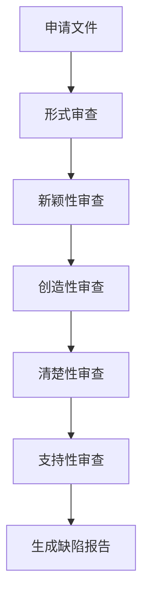

# Skill: 实质审查模拟 (Patent Examination)

## 📌 用途
模拟审查员视角，对专利申请文件进行全面审查，识别潜在缺陷。

## 🎯 功能概述
- 形式审查（格式、完整性）
- 新颖性审查（对比文件分析）
- 创造性审查（三步法）
- 清楚性审查
- 支持性审查
- 生成缺陷报告

## 📥 输入
- **专利申请文件** (`claims.md` + `specification.md`)
- **可选对比文件**

## 📤 输出
- `examination_report.md`：缺陷识别报告
- `novelty_analysis.json`：新颖性分析结果
- `inventiveness_analysis.json`：创造性分析结果

## 🔧 使用方法

### 命令行使用
```bash
python scripts/report_generator.py --claims claims.md --spec specification.md
```

### API调用
```python
from skills.patent_examination.scripts.novelty_examiner import NoveltyExaminer

examiner = NoveltyExaminer()
result = examiner.examine(
    claims_file="claims.md",
    spec_file="specification.md",
    top_k_prior_art=3
)
```

## 📋 输出示例

### examination_report.md
```markdown
# 专利审查报告

## 审查概况
- **申请号**: N/A（草稿阶段）
- **审查日期**: 2026-01-18
- **审查类型**: 实质审查模拟

## 形式审查
### ✅ 通过项
- 权利要求书格式规范
- 说明书章节完整

### ⚠️ 警告项
- 说明书段落编号不连续（建议修正）

## 新颖性审查
### 对比文件1: CN123456A
- **相似度**: 85%
- **相同技术特征**:
  - 区块链分布式存储
  - 密钥分片
- **区别技术特征**:
  - 多重签名机制（对比文件未披露）
  - 时间锁机制（对比文件未提及）

**结论**: 具有新颖性

## 创造性审查
### 三步法分析
1. **确定最接近的现有技术**: CN123456A
2. **确定区别技术特征**: 多重签名 + 时间锁
3. **判断非显而易见性**:
   - 区别特征未被其他对比文件公开
   - 技术效果显著（安全性提升30%）

**结论**: 具有创造性

## 清楚性审查
### ❌ 问题项
- 权利要求1中"N个密钥分片"的N未明确范围（致命缺陷）
- 说明书[0015]段"该方法"指代不明（一般缺陷）

## 支持性审查
### ✅ 通过项
- 权利要求1-3均得到说明书支持

### ❌ 问题项
- 权利要求4中的"访问冷却期T2"在说明书中未详细说明（严重缺陷）

## 综合评估
- **致命缺陷**: 1个
- **严重缺陷**: 1个
- **一般缺陷**: 1个

**建议**: 修复致命和严重缺陷后重新审查
```

## ⚙️ 配置项
```json
{
  "novelty_check": {
    "top_k_prior_art": 3,
    "similarity_threshold": 0.7
  },
  "inventiveness_check": {
    "enable_three_step_method": true
  },
  "defect_classification": {
    "fatal": ["unclear_scope", "lack_of_support"],
    "serious": ["ambiguous_description"],
    "general": ["formatting_issue"]
  }
}
```

## 🔗 依赖
- **新颖性检索**: Skill 6 (`patent_search`)
- **参考规范**: `docs/专利审查指南.pdf`
- **缺陷分类**: `resources/defect_taxonomy.json`

## 📊 核心逻辑

### 审查流程


### 新颖性审查逻辑
```python
class NoveltyExaminer:
    def examine(self, claims, spec):
        # 1. 调用Skill 6检索对比文件
        # 2. 提取权利要求的技术特征
        # 3. 逐项对比
        # 4. 识别区别特征
        # 5. 生成新颖性结论
        pass
```

## 🧪 测试
```bash
pytest tests/test_novelty_examiner.py
pytest tests/test_inventiveness_examiner.py
```

## ✅ 验收标准
- [ ] 能识别至少3种缺陷类型
- [ ] 缺陷报告标注位置和严重程度
- [ ] 新颖性审查至少对比3篇专利
- [ ] 创造性审查使用三步法
- [ ] 单元测试覆盖率 > 75%

## 🔄 版本历史
- v1.0 (2026-01-18): 初始版本
