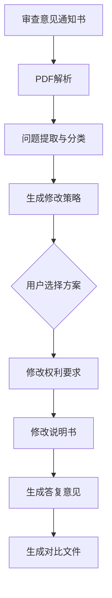

# Skill: 专利修复 (Patent Repair)

## 📌 用途
解析审查意见通知书，提供针对性修改方案和答复意见书。

## 🎯 功能概述
- 审查意见解析（TXT/PDF）
- 问题分类与分析
- 修改策略生成（多个方案）
- 权利要求修改
- 答复意见书撰写
- 生成修改后的申请文件

## 📥 输入
- **审查意见通知书** (TXT/PDF)
- **原申请文件** (`claims.md` + `specification.md`)

## 📤 输出
- `opinion_analysis.json`：审查意见解析结果
- `repair_strategies.md`：修改方案（2-3个）
- `response.md`：审查意见答复书
- `claims_modified.md`：修改后的权利要求书
- `specification_modified.md`：修改后的说明书
- `diff_report.md`：修改对比文件

## 🔧 使用方法

### 命令行使用
```bash
python scripts/opinion_parser.py --input opinion_notice.pdf
python scripts/response_writer.py --opinion opinion_analysis.json --strategy 1
```

### API调用
```python
from skills.patent_repair.scripts.repair_strategy import RepairStrategy

strategy = RepairStrategy()
solutions = strategy.generate(
    opinion_file="opinion_notice.pdf",
    original_claims="claims.md"
)
```

## 📋 输出示例

### opinion_analysis.json
```json
{
  "issues": [
    {
      "id": 1,
      "type": "clarity",
      "severity": "fatal",
      "location": "权利要求1",
      "description": "N个密钥分片中的N未明确范围",
      "examiner_opinion": "根据《专利法》第26条第4款..."
    },
    {
      "id": 2,
      "type": "support",
      "severity": "serious",
      "location": "权利要求4",
      "description": "访问冷却期T2在说明书中未详细说明"
    }
  ]
}
```

### repair_strategies.md
```markdown
# 修改方案

## 方案1：保守修改（推荐）
### 针对问题1（清楚性）
- **修改位置**: 权利要求1
- **原文**: "生成主密钥，并将所述主密钥分割为N个密钥分片"
- **修改为**: "生成主密钥，并将所述主密钥分割为5-20个密钥分片"
- **理由**: 明确N的范围，符合说明书实施例

### 针对问题2（支持性）
- **修改位置**: 说明书[0020]段
- **增加内容**: "所述访问冷却期T2优选为10-60秒，用于防止密集访问攻击..."

**优势**: 修改幅度小，保护范围基本不变  
**劣势**: 可能需要进一步答辩

## 方案2：激进修改
...
```

### response.md
```markdown
# 审查意见答复书

## 申请号
[待填写]

## 申请日
2026-01-18

## 发明名称
一种基于区块链的数据加密方法

## 答复意见

### 针对审查意见第1点（清楚性问题）
审查员指出："权利要求1中'N个密钥分片'的N未明确范围，不符合《专利法》第26条第4款的规定。"

**答复**:
申请人认可审查员的意见。经查阅说明书，在[0012]段中已明确记载"N的取值范围为5-20"。为清楚起见，申请人已将权利要求1修改为：
"生成主密钥，并将所述主密钥分割为5-20个密钥分片"

该修改有说明书支持，符合《专利法》第33条的规定，未超范围。

### 针对审查意见第2点（支持性问题）
...

## 修改说明
1. 权利要求1第3步修改（见修改后权利要求书）
2. 说明书[0020]段补充内容（见修改后说明书）

## 结论
经上述修改，本申请已克服审查意见指出的缺陷，恳请审查员予以授权。
```

## ⚙️ 配置项
```json
{
  "repair_strategies": {
    "min_strategies": 2,
    "max_strategies": 3
  },
  "response_template": "templates/response_template.md",
  "diff_format": "markdown"
}
```

## 🔗 依赖
- **PDF解析**: `shared/utils/pdf_parser.py`
- **参考规范**: `docs/专利审查指南.pdf`
- **策略库**: `resources/repair_strategies/`
- **案例库**: `resources/response_examples/`

## 📊 核心逻辑

### 修复流程


## 🧪 测试
```bash
pytest tests/test_opinion_parser.py
pytest tests/test_repair_strategy.py
pytest tests/test_response_writer.py
```

## ✅ 验收标准
- [ ] 能解析TXT/PDF格式审查意见
- [ ] 提供至少2个修改方案
- [ ] 答复意见逐条回应
- [ ] 生成修改后文件和diff
- [ ] 单元测试覆盖率 > 70%

## 🔄 版本历史
- v1.0 (2026-01-18): 初始版本
