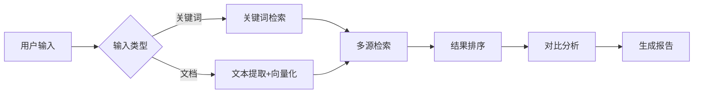

# Skill: 专利检索与分析 (Patent Search & Analysis)

## 📌 用途
提供多源专利数据检索能力，支持新颖性/创造性分析，是整个系统的核心基础设施之一。

## 🎯 功能概述
- **PDF解析**：提取本地专利文档内容
- **多源检索**：本地库、Google Patents、Google BigQuery
- **语义检索**：基于Chroma向量数据库的相似度匹配
- **对比分析**：技术方案逐项对比
- **评估报告**：新颖性/创造性自动评估

## 📥 输入
- **技术关键词**：用于关键词检索
- **技术方案文档**：用于语义检索（TXT/PDF/Markdown）
- **检索源选择**：local（本地）/ google_patents / bigquery

## 📤 输出
- `search_report.md`：检索报告（包含检索结果列表）
- `comparison_table.md`：技术方案对比表
- 新颖性/创造性评估报告（JSON）

## 🔧 使用方法

### 命令行使用
```bash
# 本地检索
python scripts/vector_searcher.py --query "区块链加密" --source local

# Google Patents检索
python scripts/google_patents_crawler.py --query "blockchain encryption" --limit 20

# BigQuery检索
python scripts/bigquery_client.py --query "区块链" --country CN --year 2020-2024
```

### API调用
```python
from skills.patent_search.scripts.vector_searcher import VectorSearcher

searcher = VectorSearcher(source="local")
results = searcher.search(
    query="一种基于区块链的数据加密方法",
    top_k=10
)
```

### 前端集成
```javascript
POST /api/v1/skills/patent-search/search
{
  "query": "技术方案描述或关键词",
  "source": "local",  // local, google_patents, bigquery
  "top_k": 10,
  "filters": {
    "year_range": [2020, 2024],
    "country": "CN"
  }
}
```

## 📋 输出示例

### search_report.md
```markdown
# 专利检索报告

## 检索条件
- **关键词**: 区块链、数据加密
- **检索源**: 本地专利库
- **检索时间**: 2026-01-18

## 检索结果

| 排名 | 专利号 | 专利名称 | 相似度 | 申请日 |
|------|--------|---------|--------|--------|
| 1 | CN123456A | 一种区块链数据存储方法 | 87.5 | 2023-05-12 |
| 2 | CN234567B | 分布式加密系统 | 82.3 | 2022-11-20 |
| ... | ... | ... | ... | ... |

## 新颖性评估
基于对比分析，本技术方案与现有专利存在以下区别特 征：
1. 采用多重签名机制（对比文件未披露）
2. 结合时间锁技术（对比文件未提及）

**结论**: 具有新颖性，建议授权可能性：高
```

### comparison_table.md
```markdown
# 技术方案对比表

## 本申请方案 vs CN123456A

| 技术特征 | 本申请 | CN123456A | 差异 |
|---------|--------|-----------|------|
| 密钥存储方式 | 区块链分布式 | 区块链分布式 | ✅ 相同 |
| 签名机制 | 多重签名 | 单一签名 | ❌ 不同 |
| 时间锁 | 有 | 无 | ❌ 不同 |
| 应用场景 | 金融数据 | 通用数据 | ❌ 不同 |

**区别技术特征**: 多重签名 + 时间锁  
**技术效果**: 提高安全性、防止密钥泄露
```

## ⚙️ 配置项

在 `config.json` 中配置：
```json
{
  "local_patent_path": "data/patents/",
  "vector_db_path": "data/vector_db/chroma",
  "pdf_parser": "pdfplumber",
  "ocr_enabled": false,
  "google_patents": {
    "rate_limit": 1,
    "max_pages": 5
  },
  "bigquery": {
    "project_id": "your-gcp-project",
    "dataset": "patents-public-data"
  }
}
```

## 🔗 依赖
- **PDF解析**: pdfplumber (主力), PyPDF2 (备选)
- **OCR**: Tesseract (可选)
- **向量库**: Chroma
- **爬虫**: requests, BeautifulSoup4
- **BigQuery**: google-cloud-bigquery
- **LLM**: DeepSeek (用于文本向量化)

## 📊 核心逻辑

### 检索流程


### PDF解析流程
```python
# scripts/pdf_parser.py 核心逻辑
class PDFParser:
    def extract_text(self, pdf_path):
        # 1. 尝试使用pdfplumber
        # 2. 如果失败，尝试PyPDF2
        # 3. 如果仍失败且开启OCR，使用Tesseract
        # 4. 返回清洗后的文本
        pass
```

### 向量检索流程
```python
# scripts/vector_searcher.py 核心逻辑
class VectorSearcher:
    def search(self, query, top_k=10):
        # 1. 查询文本向量化（调用LLM Embedding）
        # 2. Chroma相似度搜索
        # 3. 后处理：去重、过滤、排序
        # 4. 返回结果列表
        pass
```

## 🧪 测试

### 单元测试
```bash
# PDF解析测试
pytest tests/test_pdf_parser.py

# 向量检索测试
pytest tests/test_vector_searcher.py

# 爬虫测试（需Mock）
pytest tests/test_google_patents_crawler.py
```

### PDF解析测试用例
```python
# tests/test_pdf_parser.py
def test_extract_text_normal_pdf():
    parser = PDFParser()
    text = parser.extract_text("data/test/sample.pdf")
    assert len(text) > 0
    assert "专利" in text

def test_extract_with_ocr():
    parser = PDFParser(ocr_enabled=True)
    text = parser.extract_with_ocr("data/test/scanned.pdf")
    assert len(text) > 0
```

## ✅ 验收标准
- [ ] PDF解析准确率 > 95%（测试10个样本）
- [ ] 本地库检索返回Top 20结果
- [ ] 相似度评分准确（人工评估Top 5结果）
- [ ] Google Patents爬虫正常工作（尊重rate limit）
- [ ] BigQuery查询正常工作
- [ ] 生成对比表和评估报告
- [ ] 单元测试覆盖率 > 80%

## 📝 开发笔记

### PDF解析策略
1. **优先级**：pdfplumber > PyPDF2 > OCR
2. **文本清洗**：去除页眉页脚、特殊符号
3. **章节识别**：正则匹配"技术领域"、"背景技术"等标题

### 向量数据库优化
- **批量索引**：每次索引100篇专利
- **增量更新**：只索引新增专利
- **混合检索**：关键词 + 语义相似度加权

### Google Patents爬虫注意事项
- **尊重robots.txt**
- **Rate Limiting**: 1秒/请求
- **User-Agent**: 设置合理的User-Agent
- **错误处理**: 网络异常、解析失败的重试机制

### BigQuery最佳实践
- **查询优化**: 使用分区表，限制扫描量
- **缓存**: 相同查询结果缓存1小时
- **成本控制**: 设置查询扫描上限

## 🔄 版本历史
- v1.0 (2026-01-18): 初始版本，包含PDF解析、本地检索
- v1.1 (计划): 增加Google Patents爬虫
- v1.2 (计划): 增加BigQuery支持

## 🚀 扩展方向
- 支持更多专利局数据源（USPTO, EPO, WIPO）
- 专利图片识别与对比
- 专利引用关系分析
- 专利价值评估（基于引用、诉讼等）
